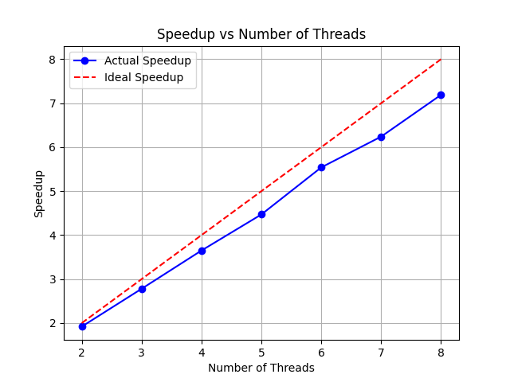
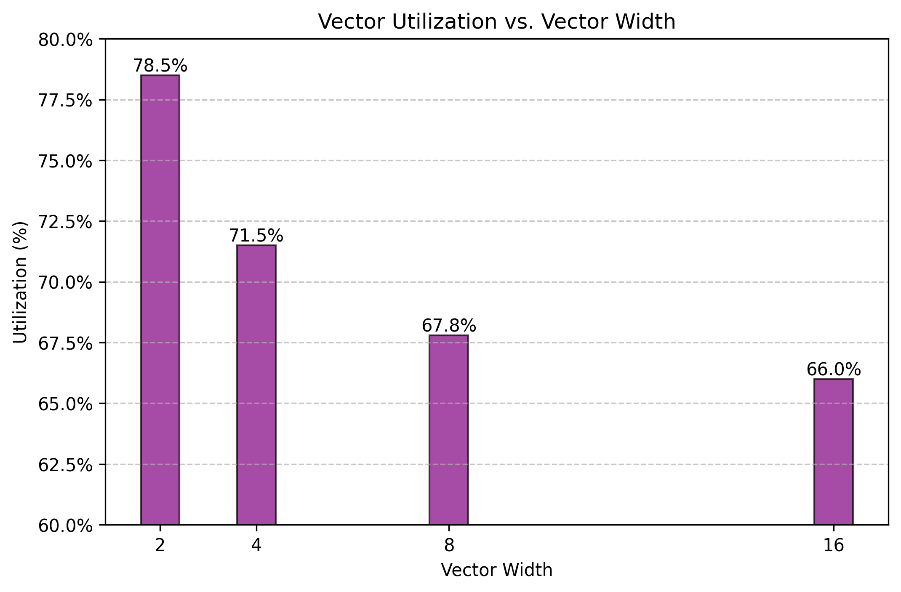

## Problem 1
The speedup is close to linear. This makes sense since the interleaving of threads chosen makes it so that each thread has about the same amount of work do to, although it's not precisely the same so that's why we're below the dashed line.

The fact that the amount of work is about the same can also be see when timing the program with 8 threads: 
```
Thread 7 took 0.054851
Thread 5 took 0.056282
Thread 0 took 0.056398
Thread 4 took 0.056623
Thread 1 took 0.057117
Thread 2 took 0.057419
Thread 3 took 0.057795
```

The result was due to the interleaving of threads, with the main idea of decomposing the set into horizontal regions that take about the same time to compute when also splitted horizontally across different threads. Note that a simple row-wise decomposition won't work as the middle of the image require more computational power, which will be the bottleneck. 

Using this approach, we see that for view 1 we get 7.19x speedup from 8 threads and 6.89x speedup for the second view with the same number of threads. For the second view, my assumption is that you can speedup the program my choosing different heights for individual regions rather than using the same height for all of them. 



## Problem 2
It turns out that the utilization goes down as we increase the width of the vector, as can be seen in: 

One reason for this behaviour is the `maskPositive` mask. For example, if you had a really big number as the first one then only ones, it would mean that the above will only have one active lane after the first iteration. As the vector width increases, this will become more noticeable. 

## Problem 3

### Part (a):
Assuming the ispc code runs on a Firestorm core and assuming that all those 4 SIMD units can be filled up, the program should technically run
32 times faster. However, computing the white regions of the set require significantly more computational power. The idea is that while the computations of each individual pixel can be performed in parallel, the complexity of different computations vary significantly, so SIMD can't help with that.


### Part (b):
We observe a 3.55x speedup from ISPC. If we launch two tasks, we observe a 2x speedup over the initial ISPC program. This makes sense,
since you can execute each of those workloads on two different CPU cores.

As for the task number, I chose it to be `100` for load-balancing purposes when it comes to the amount of work each thread has to do since the
time it takes to compute each row varies a lot. I'm assuming that the ISPC implementation has some pool of tasks and it won't let a task run for too much time. Given this, I was able to get the highest speedup of `29.40`.

## Problem 4

(1) I got

```
[sqrt serial]:          [920.342] ms
[sqrt ispc]:            [200.626] ms
[sqrt task ispc]:       [23.989] ms
                                (4.59x speedup from ISPC)
                                (38.37x speedup from task ISPC)
```

From here, we can see that the speedup due to simd units is `4.59x`, whereas the speed from this to the task variant is around `8.36x`.


(2) To improve the speed of the ISPC code without tasks, we want to maximize the vector units utilization. For this to happen, we want to
make sure there are almost no inactive lanes. This suggests that we should make the data about the same computation-wise. For example, we can
choose 
```
values[i] = 1.2 + (2 * static_cast<float>(rand()) / RAND_MAX - 1) * .01f;
```
for values in the neighbourhood of `1`. They all have amount the same computational cost.

With this, we achieve the following: 
```
[sqrt serial]:          [178.404] ms
[sqrt ispc]:            [16.170] ms
[sqrt task ispc]:       [2.260] ms
                                (11.03x speedup from ISPC)
                                (78.94x speedup from task ISPC)
```

In this case, ratio between task ISPC and ISPC alone is lower than the initial one; that is, we get less speedup when moving over to task ISPC
with these values. I'm not completely sure, but data throughput might be the issue since each task if moving more rapidly through its share of data.

(3) To make the vector instructions as useless as possible, throw a really computational expensive input once every vector width elements.
For instance, if we choose 
```
if (i % 8 == 0) {
          values[i] = 2.998f;
      } else {
          values[i] = 1.001f;
      }
```
we get the following result, where above we assumed that the vector width is 8: 

```
[sqrt serial]:          [179.411] ms
[sqrt ispc]:            [293.528] ms
[sqrt task ispc]:       [37.647] ms
                                (0.61x speedup from ISPC)
                                (4.77x speedup from task ISPC)
```
The reason behind this is that in
```
while (pred > kThreshold) {
            guess = (3.f * guess - x * guess * guess * guess) * 0.5f;
            pred = abs(guess * guess * x - 1.f);
        }
```
with `pred` being a vector of values, if one of those is really expensive to compute, then the others
will already be computed most of the time we spend in this loop and thus will stick around for nothing;
that is, we'll have all lanes expect one inactive.

## Problem 5

(1) I get 
```
[saxpy ispc]:           [3.095] ms      [96.296] GB/s   [12.925] GFLOPS
[saxpy task ispc]:      [1.756] ms      [169.701] GB/s  [22.777] GFLOPS
                                (1.76x speedup from use of tasks)
```
The memory bandwidth on my computer is around 200 GB/s but the CPU speed is about 4-5x greater, so this is definitely a memory bandwidth
problem. Furthermore, we need more memory operations rather CPU ones, but memory is in fact slower, so we cannot do better.

(2) Assuming a write-allocate cache, the address to be written to must first be in the cache, then written back when necessary (immediately or
upon eviction from cache). Thus, we'll have to first bring `result` values into the cache, then write them back, so `8` bytes in total.

## Problem 6